# Self-Supervised Learning with SimCLR on CIFAR-10

This repository implements **SimCLR** (contrastive self-supervised learning) with a **ResNet-18** backbone on **CIFAR-10**, and evaluates learned representations using the two standard SSL protocols:

1) **Linear Evaluation (frozen encoder)** → measures *representation quality*  
2) **Fine-tuning (end-to-end)** → measures *downstream performance when allowed to learn*

> **Important:** GitHub image paths are **case-sensitive** (and Windows is not).  
> If an image shows locally but not on GitHub, it’s usually because the filename/casing or folder path in the README doesn’t match exactly.

---

## 1) What we trained (why there are 4 runs)

We ran **two experiments**, each with **two initializations**:

### A) Fine-tuning (10 epochs)
- **SimCLR-pretrained → fine-tune**
- **Scratch (random init) → fine-tune**

**What learns?** Encoder ✅ + classifier ✅  
**Why 10 epochs?** CIFAR-10 is small/easy, so end-to-end training converges quickly.

### B) Linear evaluation (30 epochs)
- **SimCLR-pretrained → linear eval**
- **Scratch → linear eval**

**What learns?** Encoder ❌ (frozen) + linear classifier ✅  
**Why 30 epochs?** Only one linear layer is trained, so convergence is slower → more epochs for stability.

---

## 2) Results (numbers)

### Linear Evaluation (Frozen Encoder, 30 epochs)
| Model | Best Accuracy |
|------|--------------:|
| Scratch (random encoder) | 40.89% |
| **SimCLR-pretrained encoder** | **58.87%** |

**Gain from SSL (representation quality):** **+17.98 percentage points**

### Fine-tuning (End-to-End, 10 epochs)
| Model | Best Accuracy |
|------|--------------:|
| Scratch | **89.18%** |
| SimCLR-pretrained | 89.08% |

**Interpretation:** With end-to-end supervision on CIFAR-10, a scratch model can catch up quickly.  
This does **not** contradict SSL. Linear eval is the “pure” test of representation quality.

---

## 3) Plots: Linear Evaluation (Frozen Encoder)

> Put the exported images here:
```
results/figures/linear_eval/
```

### Test Accuracy
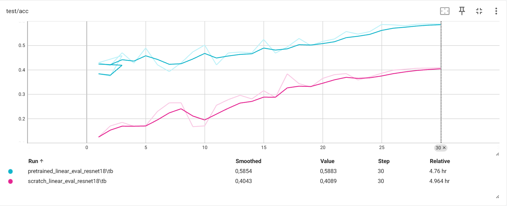

### Test Loss
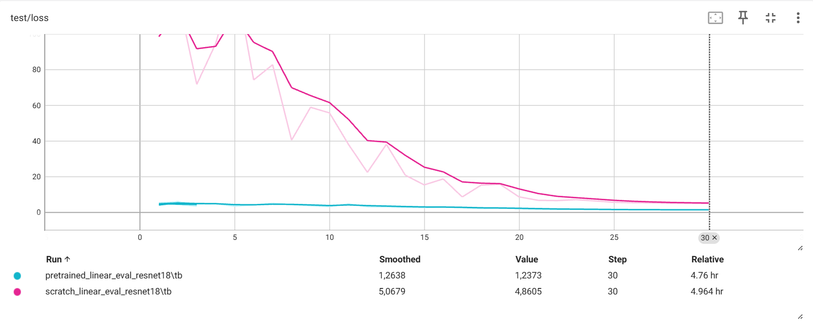

### Train Loss (epoch)
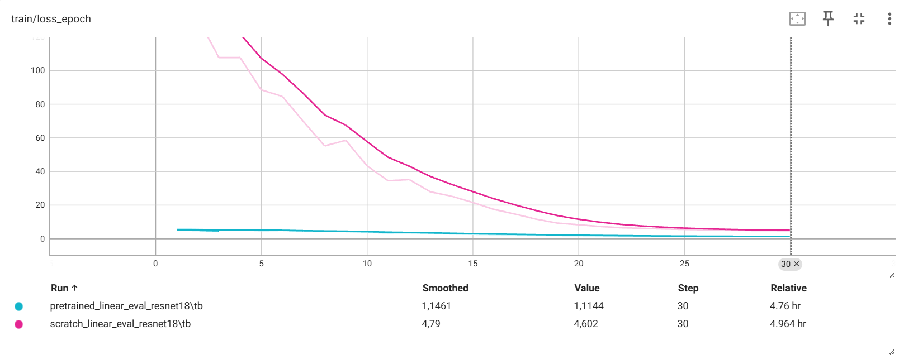

### Train Loss (step)
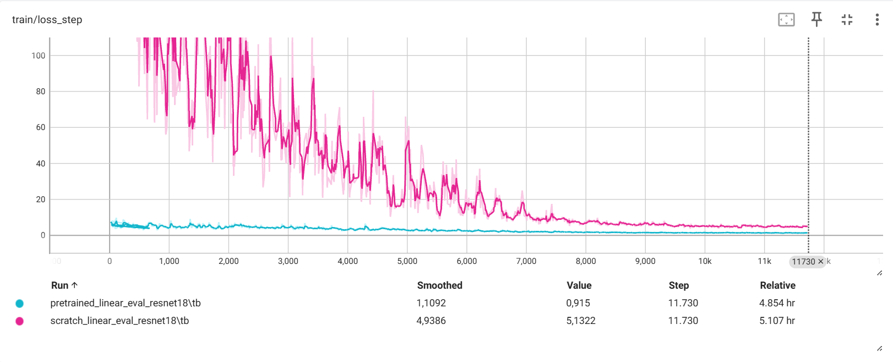

### Learning Rate
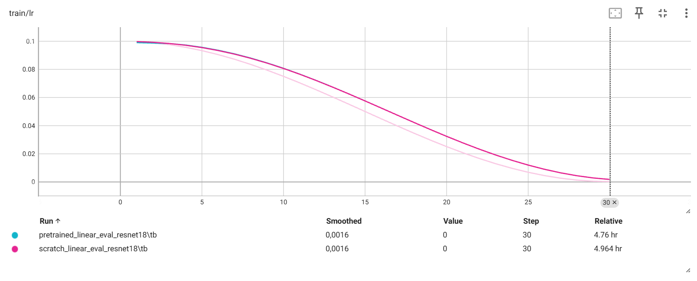

**What these plots show (why they matter):**
- Pretrained curve converges more smoothly and to a better accuracy
- Scratch has noisier optimization and worse final generalization
- Same LR schedule → fair comparison (difference comes from representation quality)

---

## 4) Plots: Fine-tuning (End-to-End)

> Put the exported fine-tuning images here:
```
results/figures/finetune/
```

### Test Accuracy
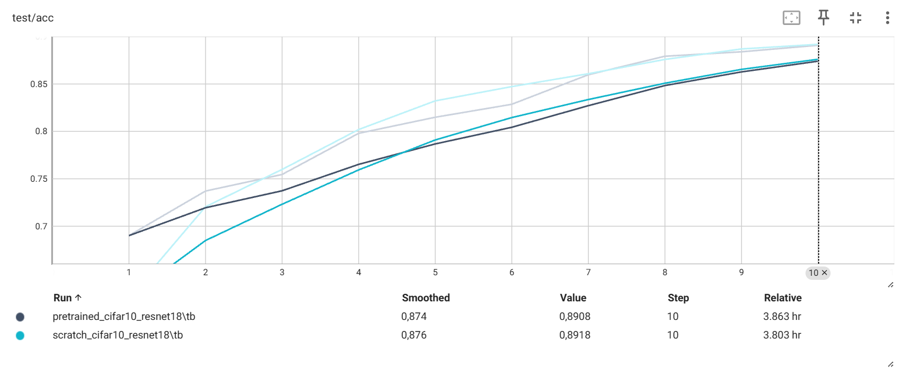

### Test Loss
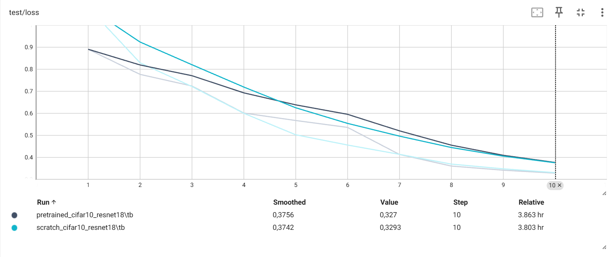

### Train Loss (epoch)
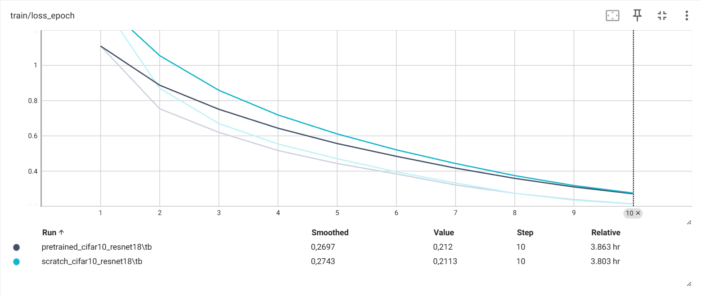

### Train Loss (step)
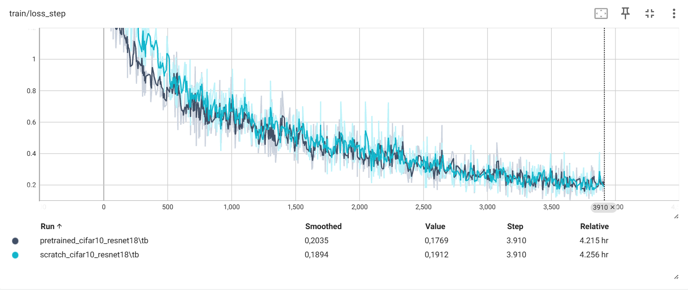

### Learning Rate
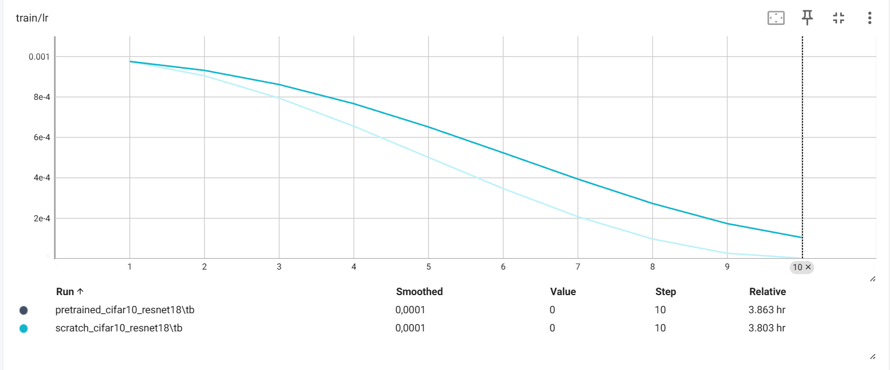

**What these plots show:**
- Both runs converge similarly (CIFAR-10 is easy with full supervision)
- Fine-tuning can hide SSL advantages because the encoder is allowed to learn everything again

---

## 5) TensorBoard logs (where they are)

All runs were logged to TensorBoard under the `runs/` directory. You can compare everything together:

```bash
tensorboard --logdir runs
```

Or view by experiment type:

```bash
tensorboard --logdir runs/linear_eval
tensorboard --logdir runs/finetune
tensorboard --logdir runs/simclr_cifar10
```

---

## 6) How to reproduce

```bash
# SimCLR pretraining
python -m src.train_simclr

# Linear evaluation
python -m src.eval_linear --mode pretrained
python -m src.eval_linear --mode scratch

# Fine-tuning
python -m src.finetune --mode pretrained
python -m src.finetune --mode scratch
```

---

## 7) Recommended repo structure for plots

To avoid confusion between linear-eval and fine-tune screenshots, keep them separate and rename consistently:

```
results/figures/
├── linear_eval/
│   ├── test_acc.png
│   ├── test_loss.png
│   ├── train_loss_epoch.png
│   ├── train_loss_step.png
│   └── train_lr.png
└── finetune/
    ├── test_acc.png
    ├── test_loss.png
    ├── train_loss_epoch.png
    ├── train_loss_step.png
    └── train_lr.png
```

## 9) Qualitative Results: Per‑Image Predictions (What the model actually sees)

Numerical accuracy alone does not fully explain *how* a model behaves.
Therefore, we additionally visualize **per‑image predictions** on unseen CIFAR‑10 test samples.

These visualizations directly show the difference between:
- Random (scratch) representations
- SimCLR‑pretrained representations

All images are sampled from the CIFAR‑10 **test set**.

---

### 9.1 Linear Evaluation – Scratch Encoder

**Setup**
- Encoder: randomly initialized, frozen
- Classifier: linear layer only


**Observed behavior**
- Very low sample accuracy (≈ 6–18%)
- Low confidence predictions
- Strong class confusion
- Sometimes prediction collapse to a dominant class

**Explanation**
With random features, the linear classifier has no meaningful structure to exploit.
This demonstrates that *good performance cannot emerge without good representations*.

---

### 9.2 Linear Evaluation – SimCLR Pretrained Encoder

**Setup**
- Encoder: SimCLR‑pretrained, frozen
- Classifier: linear layer only

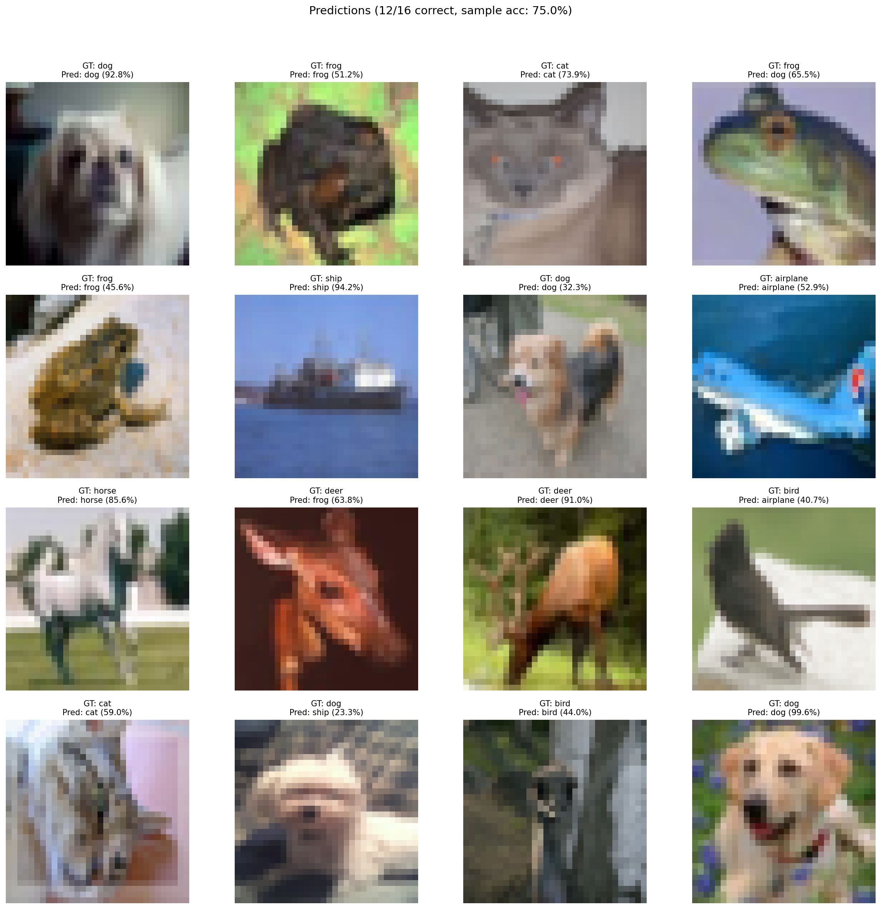

**Observed behavior**
- High sample accuracy (≈ 75%)
- High confidence predictions (often >90%)
- Clear class separation

**Explanation**
SimCLR pretraining produces **linearly separable feature representations**.
This qualitative improvement directly explains the ~18% gain observed in linear evaluation accuracy.

---

### 9.3 Failure Mode: Representation Collapse (Scratch)

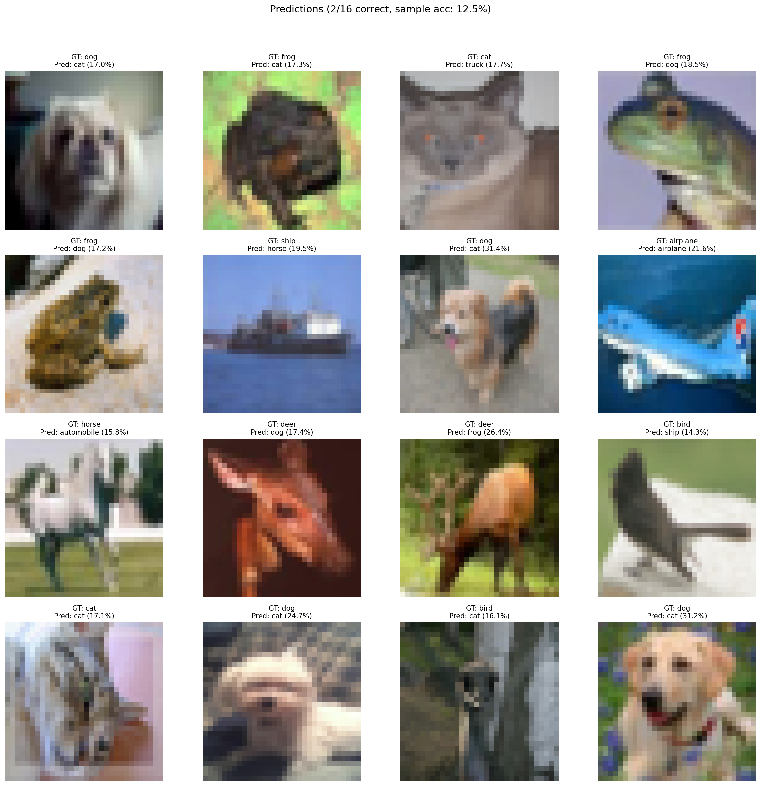

**What is happening?**
- The scratch encoder produces near‑constant features
- The classifier collapses to predicting a single class
- Softmax saturates → 100% confidence

**Why this matters**
This is a *known and expected failure mode* when representations are poor.
Including it highlights **why self‑supervised learning is necessary**.

---

## 10) How to Generate Prediction Visualizations

All qualitative results are generated using the `predict_images.py` utility.

### Linear Evaluation (Pretrained Encoder)
```bash
python -m src.predict_images   --mode linear_eval   --encoder_ckpt runs/simclr_cifar10/checkpoints/last.pt   --linear_ckpt runs/linear_eval/pretrained_linear_eval_resnet18/best_linear.pt   --n 16   --seed 1   --save_path results/predictions/linear_pretrained.png
```

### Linear Evaluation (Scratch Encoder)
```bash
python -m src.predict_images   --mode linear_eval   --encoder_ckpt NONE   --linear_ckpt runs/linear_eval/scratch_linear_eval_resnet18/best_linear.pt   --n 16   --seed 1   --save_path results/predictions/linear_scratch.png
```

### Notes
- `--n` controls the number of images shown
- `--seed` ensures reproducible image selection
- Images are always sampled from the CIFAR‑10 **test set**

---

## 11) One-line takeaway (portfolio)

**SimCLR improves representation quality by ~18% in linear evaluation (58.87% vs 40.89%), demonstrating substantially more linearly separable features than random initialization.**